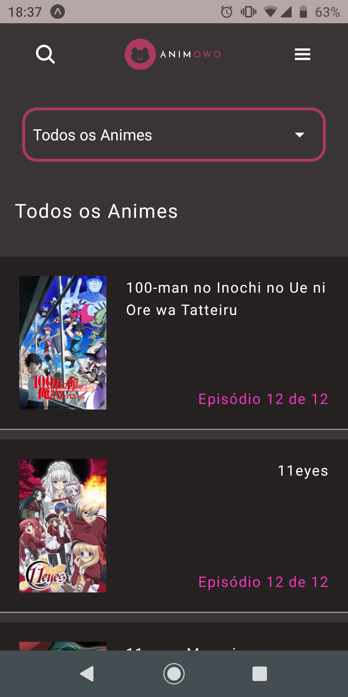
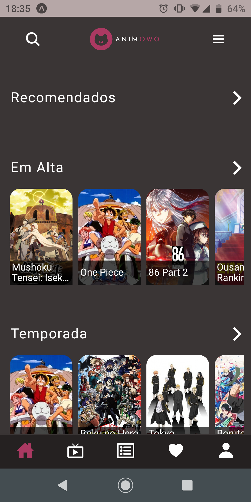
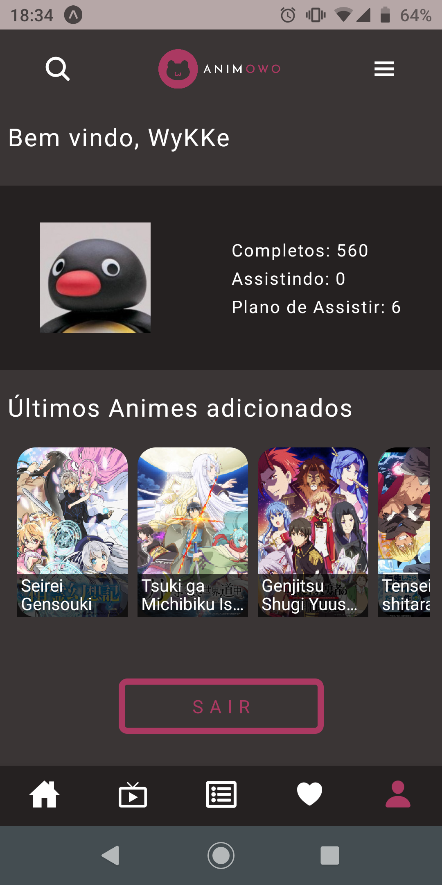

<h1 align="center">
  AnimOwO
</h1>

Trabalho feito para a Universidade Federal de Itajubá como trabalho final de graduação.

Esse projeto trata-se de um aplicativo para celular com o intuito de indexar animes e configurar listas da rede social [MyAnimeList](https://myanimelist.net).

## Rodar o cliente em desenvolvimento
### Dependências
- [Node.js](https://nodejs.org/en/)

### Comandos
- Basta utilizar o comando `yarn start`, ele abrirá uma página web como um ambiente de configuração do expo

## Screenshots

  
  
  

# Participantes

Alex Junior Pereira

Leonardo Henrique de Melo 
  
# Licença
  
O projeto está sob a licença GNU 2.0, os logos do aplicativo são de autoria própria e estão sob a mesma licença.
